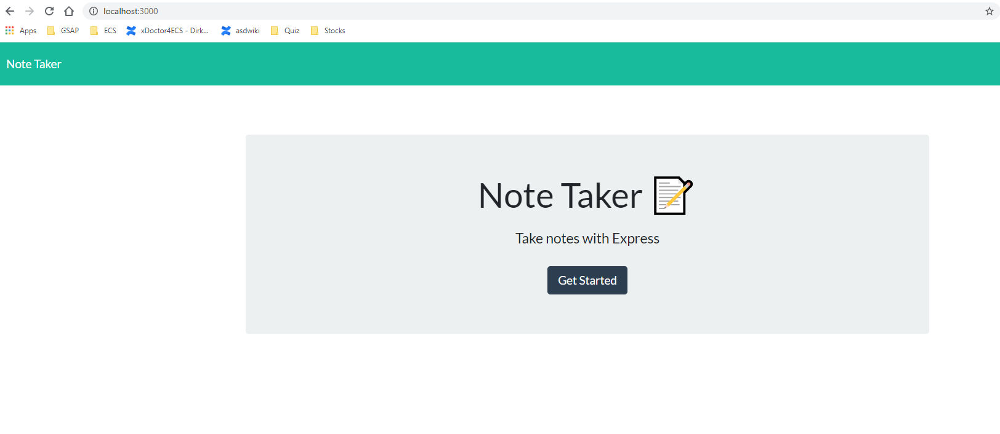
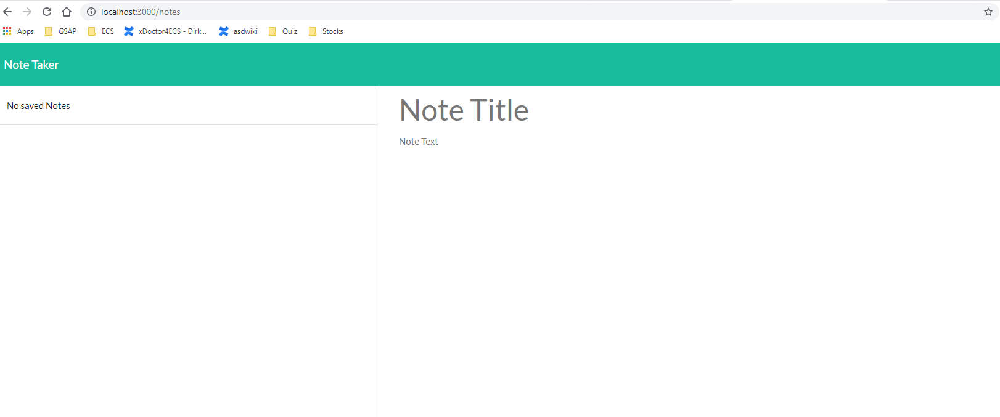
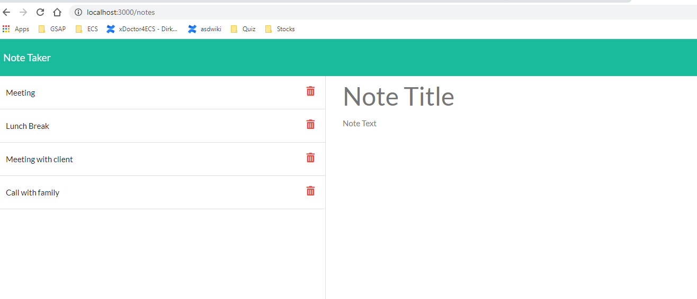

# Unit 11 Express Homework: Note Taker

## User Story

AS A user, I want to be able to write and save notes

I WANT to be able to delete notes I've written before

SO THAT I can organize my thoughts and keep track of tasks I need to complete

## GitHub Link

https://github.com/sishirbhattarai/Note-taker-app

## Heroku Deployed Link

https://notetakersishirapp.herokuapp.com/

## Technology Used:
HTML, CSS, JS, npm, node

## Testing on localhost:

## Deploying the App

You will not be able to deploy your server side code on GitHub pages. This app should be deployed on Heroku. Carefully follow the [Heroku Guide](../04-Important/HerokuGuide.md) for getting your app deployed on Heroku.

- - -

## Commit Early and Often

One of the most important skills to master as a web developer is version control. Building the habit of committing via Git is important for two reasons:

* Your commit history is a signal to employers that you are actively working on projects and learning new skills.

* Your commit history allows you to revert your codebase in the event that you need to return to a previous state.

Follow these guidelines for committing:

* Make single-purpose commits for related changes to ensure a clean, manageable history. If you are fixing two issues, make two commits.

* Write descriptive, meaningful commit messages so that you and anyone else looking at your repository can easily understand its history.

* Don't commit half-done work, for the sake of your collaborators (and your future self!).

* Test your application before you commit to ensure functionality at every step in the development process.

We would like you to have well over 200 commits by graduation, so commit early and often!

## Submission on BCS

You are required to submit the following:

* The URL of the deployed application. This should be the link to the url provided by Heroku. Be sure not to submit a link to the Heroku dashboard.

* The URL of the GitHub repository

- - -
© 2019 Trilogy Education Services, a 2U, Inc. brand. All Rights Reserved.
